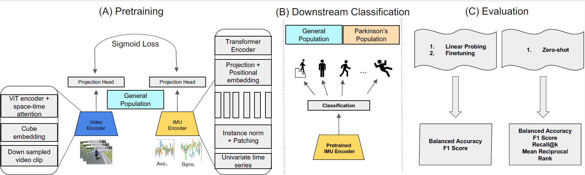

# Improving Out-of-distribution Human Activity Recognition via IMU-Video Cross-modal Representation Learning

This repository contains the official implementation of the paper:  
**“Improving Out-of-distribution Human Activity Recognition via IMU-Video Cross-modal Representation Learning”**  
(*Machine Learning for Healthcare, 2025)  
by **Seyyed Saeid Cheshmi**, **Buyao Lyu**, **Thomas Lisko**, **Rajesh Rajamani**, **Robert A. McGovern**, and **Yogatheesan Varatharajah**.

[Paper PDF](https://raw.githubusercontent.com/mlresearch/v298/main/assets/cheshmi25a/cheshmi25a.pdf)

---

## Abstract



Human Activity Recognition (HAR) based on wearable inertial sensors plays a critical role in remote health monitoring. In patients with movement disorders, the ability to detect abnormal patient movements in their home environments can enable continuous optimization of treatments and help alert caretakers as needed. Machine learning approaches have been proposed for HAR tasks using Inertial Measurement Unit (IMU) data; however, most rely on application-specific labels and lack generalizability to data collected in different environments or populations. To address this limitation, we propose a new cross-modal self-supervised pretraining approach to learn representations from large-sale unlabeled IMU-video data and demonstrate improved generalizability in HAR tasks on out of distribution (OOD) IMU datasets, including a dataset collected from patients with Parkinson's disease. Specifically, our results indicate that the proposed cross-modal pretraining approach outperforms the current state-of-the-art IMU-video pretraining approach and IMU-only pretraining under zero-shot and few-shot evaluations. Broadly, our study provides evidence that in highly dynamic data modalities, such as IMU signals, cross-modal pretraining may be a useful tool to learn generalizable data representations.

---

##  Installation

Clone the repository and install the dependencies:

```bash
git clone https://github.com/scheshmi/IMU-Video-OOD-HAR.git
cd IMU-Video-OOD-HAR
pip install -r requirements.txt
```

## Running the Code

### Training the Cross-modal Model

Pretrain the IMU–Video model using distributed data parallel with  `torchrun`:

**Example with Ego4D:**
```bash
torchrun --nproc_per_node=4 train.py \
    --model imu_video_cross \
    --dataset ego4d \
    --batch_size 32 \
    --epochs 25 \
    --lr 1e-4 \
    --clip_len 10 \
    --num_workers 16 \
    --save_interval 5
```


### Downstream Evaluation 

Evaluate pretrained IMU encoders using linear probing, finetuning.

**Linear Probing:**
```bash
python downstream.py \
    --model imu2clip \
    --checkpoint /path/to/checkpoint.pt \
    --mode lp \
    --dataset mmea \
    --batch_size 8 \
    --epochs 25 \
    --device cuda:0 \
    --train_samples 100 \
    --val_samples 20 \
    --report
```

**Finetuning:**
```bash
python downstream.py \
    --model imu2clip \
    --checkpoint /path/to/checkpoint.pt \
    --mode finetune \
    --dataset mmea \
    --batch_size 8 \
    --epochs 50 \
    --device cuda:0 \
    --train_samples 100 \
    --val_samples 20 \
    --save_model best_model.pt
```

## Citation

If this work has helped you please cite the following:

@InProceedings{pmlr-v298-cheshmi25a,
  title = 	 {Improving Out-of-distribution Human Activity Recognition via {IMU}-Video Cross-modal Representation Learning},
  author =       {Cheshmi, Seyyed Saeid and Lyu, Buyao and Lisko, Thomas and Rajamani, Rajesh and McGovern, Robert A. and Varatharajah, Yogatheesan},
  booktitle = 	 {Proceedings of the 10th Machine Learning for Healthcare Conference},
  year = 	 {2025},
  editor = 	 {Agrawal, Monica and Deshpande, Kaivalya and Engelhard, Matthew and Joshi, Shalmali and Tang, Shengpu and Urteaga, Iñigo},
  volume = 	 {298},
  series = 	 {Proceedings of Machine Learning Research},
  month = 	 {15--16 Aug},
  publisher =    {PMLR},
  pdf = 	 {https://raw.githubusercontent.com/mlresearch/v298/main/assets/cheshmi25a/cheshmi25a.pdf},

}
